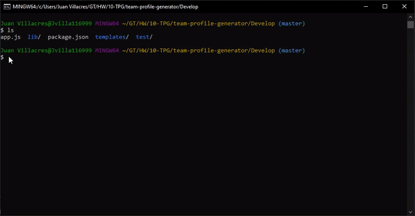
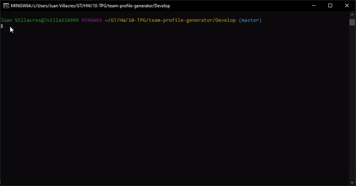
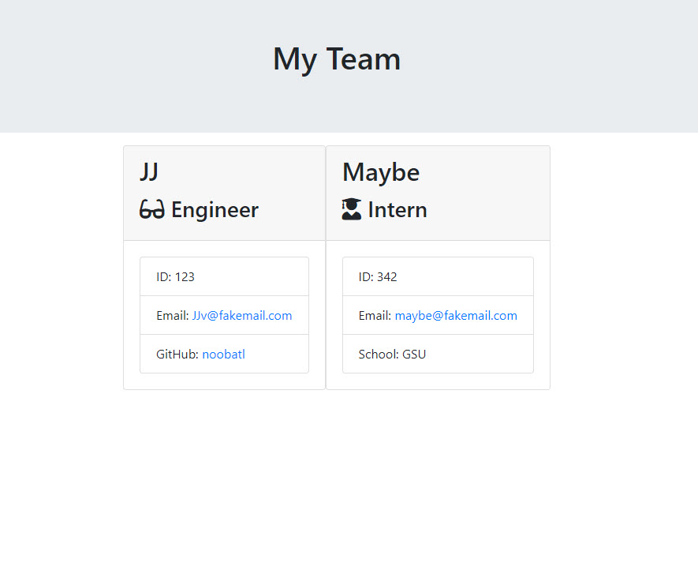

# Team Profile Generator

,,,,

## DESCRIPTION
 
As a manager, I want to generate a webpage that displays my team's basic info so that I can have quick access to emails and GitHub profiles.
As a team member, we built this project to be able to render the teams information for easy access in a website. 
The team profile generator makes it easy to compile a list of employee information in one easy to access website.
We learned the ability to use inquirer in multiple ways to not only ask important employee info, but to ask different questions depending on the employees role. 
Our project stands out from the rest because it uses a set of js files and test files to make sure the cli continues to work correctly.    

## Table of Contents

* [Installation](#installation)

* [Usage](#usage)

* [Credits](#credits)

* [License](#License)

* [Contributing](#contributing)

* [Tests](#tests)

* [Questions](#questions)
      
## INSTALLATION

npm install

## USAGE

See gif below for instruction on testing:

See gif below for instruction on using app.js:

See image below for sample output from instructions gif above:

  
## CREDITS

No collaborators in this version.
Jest for running the provided tests, and inquirer for collecting input data from the user. Help with [existssync](https://www.geeksforgeeks.org/node-js-fs-existssync-method/) and [email inquirer validation](https://gist.github.com/Amitabh-K/ae073eea3d5207efaddffde19b1618e8). [Gif Maker](https://ezgif.com/).

  
## LICENSE

MIT License Copyright (c) 2020. Permission is hereby granted, free of charge, to any person obtaining a copy of this software and associated documentation files (the 'Software'), to deal in the Software without restriction, including without limitation the rights to use, copy, modify, merge, publish, distribute, sublicense, and/or sell copies of the Software, and to permit persons to whom the Software is furnished to do so, subject to the following conditions: The above copyright notice and this permission notice shall be included in all copies or substantial portions of the Software. THE SOFTWARE IS PROVIDED 'AS IS', WITHOUT WARRANTY OF ANY KIND, EXPRESS OR IMPLIED, INCLUDING BUT NOT LIMITED TO THE WARRANTIES OF MERCHANTABILITY, FITNESS FOR A PARTICULAR PURPOSE AND NONINFRINGEMENT. IN NO EVENT SHALL THE AUTHORS OR COPYRIGHT HOLDERS BE LIABLE FOR ANY CLAIM, DAMAGES OR OTHER LIABILITY, WHETHER IN AN ACTION OF CONTRACT, TORT OR OTHERWISE, ARISING FROM, OUT OF OR IN CONNECTION WITH THE SOFTWARE OR THE USE OR OTHER DEALINGS IN THE SOFTWARE.
  
## CONTRIBUTING

Please note that this project is released with a Contributor Code of Conduct. By participating in this project you agree to abide by its terms.
  
## TESTS

npm run test || npx jest

## QUESTIONS

Username: noobatl

Email: info@noobusa.com

If you have any questions about this repo, open an issue or contact [JJ Villacres](https://github.com/noobatl) directly at the email above.
